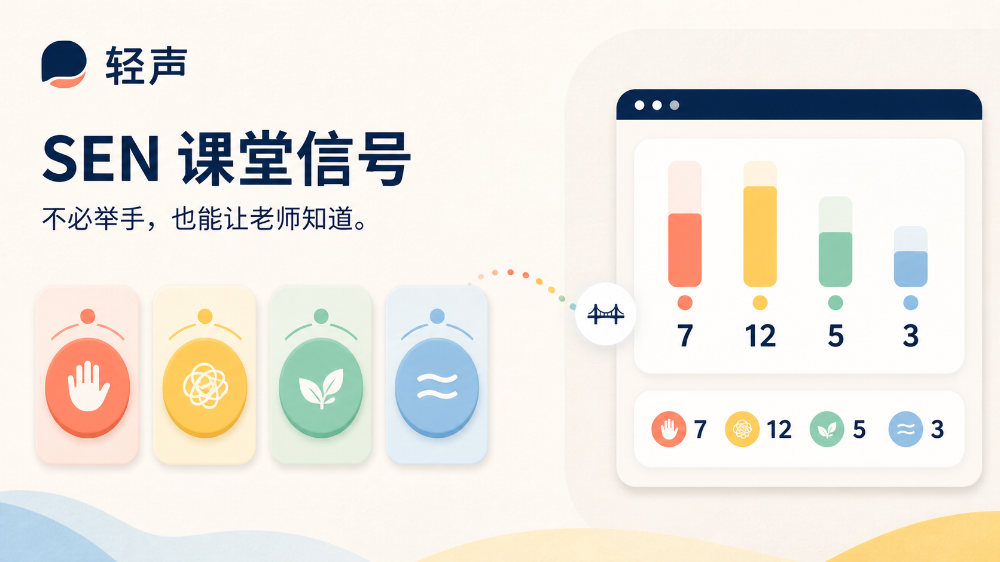

# 轻声 · SEN 课堂信号

一个让学生低调表达课堂需要、让教师及时看见班级整体趋势的双端交互原型。

[公开体验](https://biumyang.github.io/sen-classroom-signal/)



## 为什么做这个原型

部分 SEN 学生在课堂上即使已经跟不上，也可能因为表达压力、害怕引人注意或暂时无法组织语言而不举手。教师往往只能在问题累积后才发现。

这个原型验证一个具体假设：**匿名、低压力的即时信号，能否帮助教师更早调整讲课速度和解释方式，同时不把学生变成被监控的数据。**

## 可以体验什么

- 学生发送“讲慢一点”“我没听懂”“请再讲一次”和“需要短暂休息”
- 学生更换或撤回信号，并看到两分钟自动过期倒计时
- 教师端实时汇总四类信号人数
- 教师选择建议回应并发送给全班
- 学生确认收到教师回应
- 教师清除本轮课堂信号
- 查看原型采用的隐私设计原则

## 原型边界

- 所有数据只存在当前页面内，刷新后重置
- 不显示或保存学生姓名
- 不使用摄像头、麦克风或行为识别
- 不生成专注度、表现或风险分数
- 不诊断学生是否有 SEN

这不是一个完整课堂管理系统。下一步应邀请学生、SENCO 和教师共同测试：学生是否真的愿意使用、老师能否在不被提示打断的情况下作出回应，以及匿名机制会不会被滥用。

## 本地运行

需要 Node.js 22.13 或以上版本，以及 pnpm。

```bash
pnpm install
pnpm dev
```

打开 `http://localhost:3000`。

## 验证

```bash
pnpm lint
pnpm test
```

## 技术

React 19、TypeScript、Vinext、Vite、Cloudflare Workers。

## License

MIT
